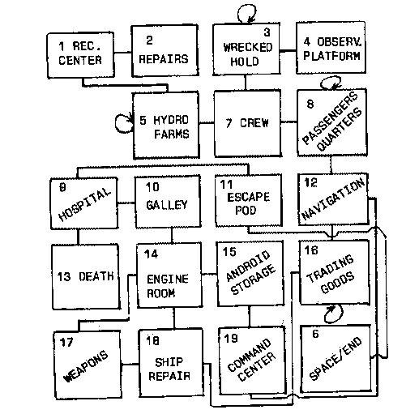

18 TRICKS AND TRAPS
=====
I hope you have entered the Asimovian Disaster program, and attempted to solve it before coming to this chapter. You will gain far more from this book by doing so, rather than just reading on, without actually entering the material as you come to it.

The Map
-----
First of all, the map is far more complex than was the castle map:

There are several unusual things about this map, things you should include in your own, hard-to-solve Adventure programs.

For a start, some of the rooms (3, 5, 8, and 16) have "endless loop" exits which leave you where you started. This is a useful technique if you want to give the impression of size. All these rooms, as you'll see if you check the map, are large rooms which could quite conceivably stretch for a long, long way. The hydroponic farms (room 5) could cover acres, and the hold (room 3) where you start, along with the hold which contains goods for trading (room 16), could be almost as big.

The other room (room 8) contains over 1,000 passengers so it must be fairly large.

You should use this "endless loop" idea in two situations. The first is when you want something to appear very big ("YOU ARE IN A DESERT WHICH STRETCHES FOR MILES IN EVERY DIRECTION"). The second situation is when you want to trap the player in a maze, which has only one way out, which may well be the uttering of a magic word or the bribing of a dwarfling rather than finding a hidden exit.

What Goes Up
----
To further confuse players, you can have rooms connected by tunnels which do not connect them from expected directions (as could happen within a massive spaceship or in an underground labyrinth). To try and explain what I mean by this, look at rooms 14 and 17. To go from 14 to 17 you leave to the west, but you leave to the north from room 17 to get back to 14.

The situation is even more confusing with rooms 15, 19, and 16 (and further compounded by 16's endless loop). You go down from 15 to reach 19 (and up from 19 to get back to 15) but south from 19 to enter 12 from the west. Figuring that one out could take an Adventurer many hours.

Room of Death
----
If you make the wrong decision in the hospital (room 9) you end up in room 13, which is not a room at all, but "death by radiation." As you'll see if you trace the way "room 13" is used, spare rooms like this can be very convenient as ways of storing special deaths for the player.
One-Way System
Although all connections in this game are two-way (a situation which does not have to occur) you'll see by looking carefully at the map that the player can end up in some pretty dead ends. Room 2, for example, forces the player to retrace his or her steps all the way back to room 7, before any real progress can be made. Room 4, the observation platform, provides nothing but a look at the stars (which, if nothing else, helps set the atmosphere of the Adventure).

The only way to get to the room where you'll find your Escape Pod is via one or more of the rooms at the bottom of the map, and-as we've discussed earlier-there are a number of confusing traps in this section.

Adding It All Up
----
By studying this Adventure, and especially the map and its corresponding Travel Table held in the DATA statements, you'll learn a lot about ways of making your Adventures harder to solve, while still keeping to the rule regarding a coherent environment.

Roll Your Own
-----
You've seen how easy it is to modify a given listing to produce an Adventure program which appears totally original. You could now go back to the very first WEREWOLVES AND WANDERER and draw up a map of your own, in the setting of a scenario which you've thought of, and write an Adventure program of your own. As you can see from THE ASIMOVIAN DISASTER, much of the work has already been done for you.
