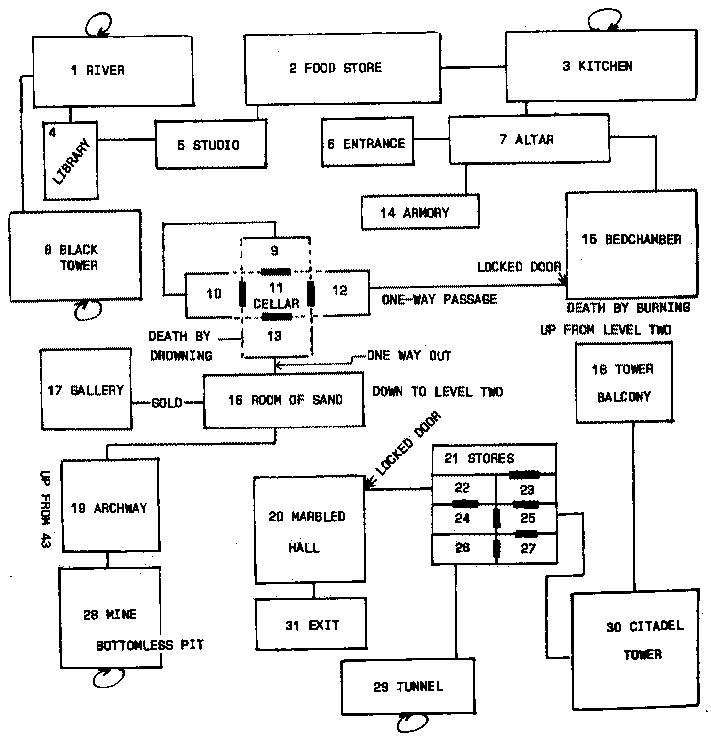
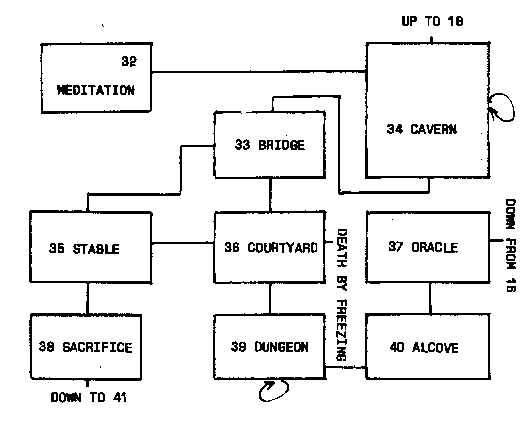
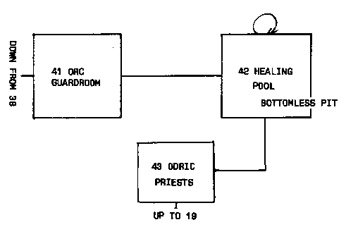

19 THE CITADEL OF PERSHU
=====
Our next program, the biggest in the book so far, occupies around 18K. THE CITADEL OF PERSHU pits you against a fantastic array of monsters and assorted deviant entities. It has more than 40 rooms and the action takes place on three different levels.

This program brings together all the ideas we've discussed so far for Adventure programs, and adds a number of new ones, such as the ability to carry objects and to drop them in rooms (and discover, wonder of wonders, that they are still there when the room is revisited).

The fights are less under the control of the random number generator, and you more or less control the "attributes" (your characteristics within the Adventure) with which you will fight. If you don't like the odds at the beginning of a melee, you can even invoke magic spells (you have three per game) which guarantee that you'll win that particular battle.

This is emphatically not an easy Adventure to solve. There are a number of tricks and traps within it, not all of which I will explain to you. It seems to me to make much more sense to throw you straight into the Adventure, and let you encounter (and eventually solve) the problems presented to you. Examining the relevant part of the listing after you've solved the problem will fairly quickly reveal how the problem was encoded into the program, and investigating this will show you how to include such puzzles within your own Adventure programs.

The Vocabulary
-----
Many Adventure programs, as I pointed out earlier, appear to cater to very wide vocabularies. This program, like the ones which precede it, accepts only a limited set of words, and needs these as single letter input.

This is satisfactory for the time being, although you'll probably be interested to know that when we get to our next program, the last one in the book, we will be using a form of input which allows the computer to accept, and understand, two-word commands, like GET AXE, SLAY DRAGON, and DROP DIAMOND.

However, the emphasis in this program, apart from being designed to act as a teaching tool, is on ease of playing, so that the player can concentrate on deciphering the map, and on getting to the end of the apparently endless maze of rooms, stairways, and passages.

Therefore, nearly all inputs are taken in the form of INKEY$, so you do not need to press RETURN after entering a command. Here is the standard vocabulary, and apart from entering a number when confronted with a menu of choices from time to time, this vocabulary is all you will need (enter just the first letter):
```
Quit
Fight
Run (away from a fight; rarely successful)
Pick up (there is only one object in a room, so it knows which one you mean)
Get rid of (you can only drop something you are carrying which you indicate from a menu, and you cannot drop something if there is already an object in the room; monsters do not count as objects)
North
South
East
West
Up
Down
```
Snapshots
----
This apparently small vocabulary allows you a surprising degree of choice in many situations, as you can see from these "snapshots" of THE CITADEL OF PERSHU in action:
```
ANDREW
MAGIC SPELLS: YOU HAVE 3 LEFT
YOU HAVE          $ 100

STRENGTH: 12    CHARISMA: 9
DEXTERITY: 3    INTELLIGENCE: 3
WISDOM: 12    CONSTITUTION: 18

THIS IS THE ENTRANCE TO THE CITADEL OF PERSHU
TURN NOW, IF YOU WISH. MANY STRONGER THAN YOU
HAVE TAKEN FRIGHT AT ITS MENACING TOWERS AND
DARK PORTALS. IF YOU WISH TO PROCEED, MOVE
EAST TOWARDS THE BLACK, GAPING DOORWAY...


YOU CAN SEE....
FLAMING TORCH

WHAT DO YOU WANT TO DO? P


----------------------------------

ANDREW
MAGIC SPELLS: YOU HAVE 3 LEFT
YOU HAVE FLAMING TORCH         $ 100

STRENGTH: 12    CHARISMA: 9
DEXTERITY: 3    INTELLIGENCE: 3
WISDOM: 12    CONSTITUTION: 18

A STONE ALTAR STANDS IN THE MIDDLE OF THE ROOM
WITH TWO DEAD CANDLES ON IT. AN OLD BOOK LIES
ON ONE PART OF THE ALTAR TOP, AND A FADED, RED
PARCHMENT CLOTH COVERS THE FRONT OF IT

YOU CAN SEE....
CHAIN MAIL ARMOR

WHAT DO YOU WANT TO DO? P
Later in the same game....

ANDREW
MAGIC SPELLS: YOU HAVE 3 LEFT
YOU HAVE FLAMING TORCH SILVER KEY
         CHAIN MAIL ARMOR    $ 310
STRENGTH: 12    CHARISMA: 9
DEXTERITY: 3    INTELLIGENCE: 3
WISDOM: 12    CONSTITUTION: 18

YOU ARE IN THE RULER'S BEDCHAMBER
A LARGE FIRE BURNS IN THE SOUTH OF
THE ROOM, WITH A SHALL DOOR BESIDE
IT. OTHER EXITS ARE TO THE NORTH
AND TO THE WEST

THE ROOM CONTAINS A MAGI
WITH ATTRIBUTES AS FOLLOWS:
STRENGTH: 15    CHARISMA: 12
DEXTERITY: 18    INTELLIGENCE: 6
WISDOM: 9    CONSTITUTION: 15

WHAT DO YOU WANT TO DO? F

YOUR ATTRIBUTES ARE:
1 - STRENGTH 12    2 - CHARISMA 9
3 - DEXTERITY 3   4 - INTELLIGENCE 3
5 - WISDOM 12      6 - CONSTITUTION 18

CHAIN MAIL ARMOR GIVES YOU AN EDGE
ENTER 1 TO FIGHT WITH MAGIC
OR 2 TO RELY ON SKILL? 2

WHICH ATTRIBUTES TO FIGHT WITH (2)? 5,6

YOU WOUND THE MAGI
YOU HAVE KILLED THE MAGI
----------------------------------
Still later....

ANDREW
MAGIC SPELLS: YOU HAVE 3 LEFT
MONSTERS KILLED: 2
YOU HAVE FLAMING TORCH         $100

STRENGTH: 2    CHARISMA: 17
DEXTERITY: 3    INTELLIGENCE: 18

WISDOM: 5    CONSTITUTION: 2

YOU ARE IN THE CENTRAL, CIRCULAR
AREA OF THE WINE CELLAR. THERE IS
A DOOR AT EACH COMPASS POINT.

THE ROOM CONTAINS A HELL HOUND
WITH ATTRIBUTES AS FOLLOWS:
STRENGTH: 12    CHARISMA: 6
DEXTERITY: 15    INTELLIGENCE: 18
WISDOM: 6    CONSTITUTION: 9

WHAT DO YOU WANT TO DO? F


ENTER 1 TO FIGHT WITH MAGIC
OR 2 TO RELY ON SKILL? 2

WHICH ATTRIBUTES TO FIGHT WITH (2)? 4,2

THE FIGHT STARTS IN FAVOR OF YOU
THE HELL HOUND - 24
ANDREW - 35

YOU WOUND THE HELL HOUND
THE HELL HOUND - 23
ANDREW - 35

YOU WOUND THE HELL HOUND
THE HELL HOUND - 22
ANDREW - 35

YOU GET IN A GLANCING BLOW
THE HELL HOUND - 21
ANDREW - 35

YOU ARE WOUNDED!!
YOU HAVE KILLED THE HELL HOUND
And finally....

THE FLAMES STRIKE AT VOU...
AS YOU SLOWLY BURN TO DEATH

YOUR FINAL SCORE, ANDREW, IS 1145
YOU COMPLETED 13 % OF THE QUEST
```
Attributes
-----
As you can see from the above, you are blessed with six characteristics in this game:
```
STRENGTH-raw muscle power
INTELLIGENCE-raw brain-power
CHARISMA-personal magnetism
WISDOM-brain-power tempered by experience
DEXTERITY-ability with weapons
CONSTITUTION-stamina
```
Due to the strange workings of the world within which this Adventure takes place, every entity you meet (from the PHASE SPIDER and HYDRA OF 10 HEADS to the FIRE LIZARD and NECROMANCER) has exactly the same characteristics. However, you only have to fight with two of them. If you are wise, you will choose the two in which you most exceed the enemy. You battle it out based on the total of the two chosen attributes, modified to some extent (in your favor) by the weapons (SWORD or WAR HAMMER), protective devices (CHAIN MAIL ARMOR, SHIELD, CLOAK OF PROTECTION), and all-purpose thingy (WAND OF FIREBALLS).

Don't worry if this seems complex. It should all be perfectly clear when you actually run the program. Once you examine the relevant part of the program (lines 3690 to 4190), you'll see how the attributes are used to set up the background for the fight, and how they are modified while the fight is in progress. Note that a serious defeat can kill you, at which point the program terminates abruptly.

The Goodies
-----
There are many treasures lying around the Citadel. Although you can pick these up (and the more wealth you have at the end of the game, the better your final score), you cannot drop them. When you pick them up, their value is added to your wealth, and they cease to exist in any other form.

The treasures you'll find around the Citadel, with different values each time you play the game, are:
```
EMERALDS             PIECES OF EIGHT
SILVER RINGS         ELEMENTAL GEMS
ELVEN AMYTHESTS      SHAPE-SHIFTING STONES
DIAMOND DRAGON EYES  GOLD DUBLOONS
A CRYSTAL BALL
```
As well as the nine treasures above, there are nine objects (mentioned a short while ago) which you may come across during the game, and these you may pick up (and, if you choose, put down). The nine objects are:
```
A FLAMING TORCH      CHAIN MAIL ARMOR
SILVER KEY           SHIELD
GOLD KEY             CLOAK OF PROTECTION
SWORD                WAND OF FIREBALLS
WAR HAMMER
```
The two keys are important. There are two locked doors in the Adventure, which bar you from discovering further parts of the map. You cannot get past these doors without the relevant keys. The first locked door needs the silver key (the first key you'll find) and the second one (right near the end of the Adventure) demands the gold one. The keys effectively vanish from your possession after they have been used, as they stay in their relevant doors. They can't be used for anything else anyway.

You are utterly lost without the torch, so you must pick it up the moment you see it. Without it (as you'll discover if you put it down in a room, when it is immediately extinguished!) you won't be able to see anything. (If you do want to experiment by putting the torch down, you'll be pleased to discover that it automatically' relights itself when picked up.)

Picking things up from rooms, and placing objects there adds another dimension of "reality" to an Adventure environment, as you'll discover. Dropping something in one room, wandering about for a while, and then returning and finding it still there is (to my humble mind, anyway) quite exciting, as it adds another degree of solidity to the world you have created and are experiencing.

Be warned, this is a pretty weird map. The "store rooms" are a labyrinth of seven interconnected rooms, and you must work your way through them to get to the exit which, after all, is the point of the program.

The wine cellar is a miracle of modern architecture. It consists of a central, circular area, with a room at each compass point. A tunnel connects the north door of the northern room with the west door of the western room.

As you can see from these two rooms alone, working out the map is not going to be easy.

Multiple Choice Death
-----
The program actually allows for 47 rooms, rather than the 43 which are on the map. The final four "rooms" are for rather dramatic deaths. When you think about it, you can see that a death is, more or less, "entered" from a room, especially when you fall into a fire, or step in a swiftly flowing stream which bears you away to a watery grave. The dramatic deaths which are disguised as rooms in this Adventure are as follows:

* Room 44-death by drowning
* Room 45-death by burning
* Room 46-freezing forever into living stone by magic
* Room 47-death by falling into a bottomless pit

You can easily incorporate deaths into your own programs in this way. Allowing people to tumble to their deaths from high towers, or to stumble down bottomless pits when the room is so filled with smoke they cannot see properly (as happens in this Adventure) is a good way of keeping the tension level high.

Incidents like these deaths, along with the extremely complex (but still consistent and stable) map, ensure that your friends will not easily solve this Adventure. You're going to have enough problems yourself, especially if you do not cheat, and do not look at the map before you try and work it out yourself.

The Baddies
------
Your problems will be compounded by the enemies you'll have to confront within the Citadel. Those you meet will be chosen from the following list (and they, like the treasure, will be in different locations each time you run the program): SWASHBUCKLER, WEREBEAR, CAECLIAE, MANTICORE, VAMPIRE, PREDEBEAST, GARGOYLE, MEDUSAE, MAGI, FIRE LIZARD, PHASE SPIDER, TROLL, HELL HOUND, FROST GIANT, NECROMANCER, HYDRA OF 10 HEADS, PATRIACH, MASTER THIEF, and LIVING STATUE.

Compressing the Program
-----
As you'll see when you examine the complete listing (occupying, as I said, around 18K on my system, an IBM PC, and demanding around two and a half K working space) in the next chapter, it is well supported with REM statements. To save time, you can drop any REM statement which is a row of asterisks (these serve as visual markers, and these line numbers are not called by GOSUBs), as well as any REM statement which follows a line. Do not get rid of REM statements which stand alone, as these are nearly always called by a GOSUB.

Another way of compressing the program is to get rid of all but the first line of description of a room. The PRINT statements, as you'll soon see, take up a massive portion of the room. If you replace a line like REM ROOM 1 with a terse description such as UNDERGROUND RIVER:RETURN, you can then get rid of all the lines which follow the REM in the original listing, up to and including the terminating RETURN.

If you do this to squeeze the program into limited memory, make sure the ON ... GOSUB calls (lines 470 to 520) actually still do reference the relevant brief descriptions. (If you like, you can provide players with cards which contain the rest of the description, so they can read the information you are unable to fit into your computer. If you do this, you should label the rooms in some way-such as Al, A2, and so on-to make it easy for the player to find the relevant card without undue delay.)

The Maps
-----
Finally, here is the map of the Citadel. I suggest you do not look at it until after you have attempted to solve the Adventure using your own brains. Then, by all means, come back to it in this book, and compare it with your own map. This comparison, and a close inspection of how the program achieves its various ends will serve as an excellent illustration for our discussions on creating Adventure games.






