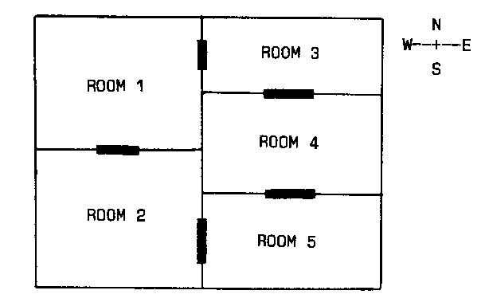

4 CREATING THE FLOOR PLAN
=======

In this chapter we will examine the critical problem of how to get your computer to keep track of the complicated "floor plan" or "map" used in an Adventure game. We'll take a careful look at how to write a program that keeps track of a simple five-room environment. Note that the program sections in this chapter refer only to this simplified environment, and are not part of WEREWOLVES AND WANDERER. Follow through the explanations and examples carefully. The concepts outlined here will later be expanded for use n our first full-scale Adventure program, WEREWOLVES AND WANDERER.

Mapping the Environment
------------

As was pointed out earlier, an Adventure environment must be coherent. That is, the explorer making his way through the environment must be able to draw up a complete map as he works his way through it. If he draws a door connecting the study with the library on an environment floor plan, because he has discovered that going through the study door leads into the library, he is entitled to expect that turning around and going back will bring him back into the study. The game-player should be able to build up an entire plan in this way, checking his plan from time to time by "walking around" the house, castle, forest, underground labyrinth, or whatever where the Adventure is taking place.
The first step, then, in building an Adventure program is to construct an environment which can be both mapped, and represented in some way which the computer can store.

You'll be pleased to know it is relatively easy to satisfy both these conditions.

Look at the following five-room environment, a very simple one, which we shall treat as though it was a computer Adventure environment.



The key to holding an environment like this in a way the computer can understand and manipulate is to set up an array, each element of which represents a room. The solid markers between rooms are doors.

If you were in room one, you could move east into room three, or south into room two. In room four you can move north into room three and south into room five, and so on. Imagine we have set up an array, which we have dimensioned as DIM A(5,4). The first dimension is the room, and the second one is the four possible directions from that room (that is, north, south, east, and west).

Building a Travel Table
---------

Armed with the map of the five-room environment, we can now build up a Travel Table, which can then be fed into the array, to allow us to move from point to point within the environment.

Here's the Travel Table for the simple, five-room environment:
```
ROOM   N S E W
  1    0 2 3 0
  2    1 0 5 0
  3    0 4 0 1
  4    3 5 0 0
  5    4 0 0 2
  ```

Take some time to study this table, and the way it relates to the map, because it is the single most important key to building Adventure programs you will learn from this book.
Look at the table for room one. Under the "N" (for north) column we see a zero, meaning you cannot move north from room one (a fact which is easily verified by looking at our map). However, under the "S" we see the number two, meaning that if we traveled south from room one we would end up in room two (again, you can verify this from the map). Move east (the "E" column, of course) from room one, and you'll end up in room three. The 0 in the "W" column means there is no travel possible west from room one.

You can work right through the table, if you like, checking that the numbers on it correspond to the "reality" of the map.

Now, to allow the player to move around the environment, we only need to (a) fill each element of the array with the relevant information from the Travel Table; (b) tell the player where he or she is; and (c) allow the decisions entered by the player regarding the direction he or she wants to move to be checked against the array, and then-if possible-updated to reflect the player's new location. It is easier to do this than you might think.

Moving About
-------

Firstly, we need to write a small program to feed the relevant information into the array. Two simple READ/DATA loops like the following will do it:

```
10  DIM A(5,4)
20  FOR B = 1 TO 5
30  FOR C = 1 TO 4
40  READ A(B,C)
50  NEXT C
60  NEXT B
70  DATA 0,2,3,0
80  DATA 1,0,5,0
90  DATA 0,4,0,1
100 DATA 3,5,0,0
110 DATA 4,0,0,2
```

As you can see, the DATA statements correspond exactly with the items in our Travel Table.

This will fill the A array as follows:

```
A(1,1) = 0
A(1,2) = 2
A(1,3) = 3
A(1,4) = 4

A(2,1) = 1
A(2,2) = 0
A(2,3) = 5
A(2,4) = 0

A(3,1) = 0
A(3,2) = 4
A(3,3) = 0
A(3,4) = 1

A(4,1) = 3
A(4,2) = 5
A(4,3) = 0
A(4,4) = 0

A(5,1) = 4
A(5,2) = 0
A(5,3) = 0
A(5,4) = 2
```

Looking at these, we can see that the first number which comes after the A is the room number, and the second is the room the player ends up in if he or she moves in a direction where the first direction is north, the second is south, the third of course is east, and the final direction is west. This is all suggested by our Travel Table. I hope by now you are beginning to appreciate just how central the Travel Table is to constructing and manipulating an artificial environment.

The Player's Location
--------

If we decided that the room the player is currently occupying could be designated by the variable RO (as we do, in fact, use in both WEREWOLVES AND WANDERER and THE ASIMOVIAN DISASTER), we could tell the player where he or she was as follows, as well as indicating which exits existed:

```
100 PRINT "YOU ARE IN ROOM NUMBER ";RO
110 IF A(RO,1) <> 0 THEN PRINT "A DOOR LEADS NORTH"
120 IF A(RO,2) <> 0 THEN PRINT "THERE IS AN EXIT TO THE SOUTH"
130 IF A(RO,3) <> 0 THEN PRINT "YOU CAN LEAVE VIA THE EAST EXIT"
140 IF A(RO,4) <> 0 THEN PRINT "A DOORWAY OPENS TO THE WEST"
```

The player's input could be a single letter ("N" for north, and so on) and the program could look at the input, and check to see if an exit to that direction existed:

```
150 INPUT "WHICH DIRECTION";D$
160 IF D$ = "N" AND A(RO,1) = 0 THEN PRINT "YOU CANNOT MOVE THAT WAY"
170 IF D$ = "S" AND A(RO,2) = 0 THEN PRINT "YOU CAN'T WALK THROUGH WALLS"
180 IF D$ = "E" AND A(RO,3) = 0 THEN PRINT "TRY ANOTHER DIRECTION"
190 IF D$ = "W" AND A(RO,4) = 0 THEN PRINT "THERE IS NO DOOR TO THE WEST"
```
As you'll see shortly, exactly this system is used in our Adventure programs.

So you can see how the array, constructed using the Travel Table, can indicate where the player may or may not move. What about the movement itself?

Moving Around the Map
---------

The "you can't move that way" tests, of lines 160 to 190, could trigger a repeat of the input question, "WHICH DIRECTION?," over and over again until a valid direction was entered. Then the movement itself could take place. (Note, by the way, that the room numbers are never referred to explicitly, as they are for the computer's internal use only; all the player hears about are names of rooms-YOU ARE IN THE COUNTING HOUSE-and, in many cases, the contents of the room, and possible exits from it.)

If the player entered "N" (for north), as he or she was in room four (look to the map, to see what this would mean) the computer could proceed as follows. Firstly, the variable RO would equal 4. A short routine could convert the "N" into a 1 (for the first element of the array), so the computer would know the player was about to go into the room number A(RO,1). As RO equals 4, A(4, 1) gives 3. This means the player would be moving into room number 3 (which, as a quick check of the map will reveal, is north of room 4). The variable RO would be set equal to three, so the player could be told "YOU ARE IN ROOM 3. The next choice of direction could then be entered, and so the player would continue happily tripping through the environment.

Consistency and Reality
-----------

Although the rooms only exist on paper and in elements in an array, the fact that they behave like "real rooms" soon allows them to be perceived as though they were solid and real in a way which is uncanny. Add descriptions of each room-YOU ARE IN A SMALL WORKMAN'S HUT ATTACHED TO THE BACK OF THE MANOR HOUSE, WITH A PILE OF STRAW OVER IN THE FAR CORNER, AND A SHOVEL AND AN AXE LYING UNDERNEATH THE WINDOW. A LARGE LOAF OF BREAD IS ON THE TABLE, AND BESIDE IT IS A NOTE. DOORS LEAVE TO THE NORTH AND TO THE WEST-and you'll find the environment takes on quite solid dimensions in your mind.

Once the map becomes more complex, as in WEREWOLVES AND WANDERER (and to a much greater extent in THE ASIMOVIAN DISASTER), and the descriptions help clarify the mental images of the rooms, you'll find you have a counterfeit reality with immense power in your hands.

You might like to try and write a simple program, before proceeding further, which allows you to move around the five-room environment we've been looking at.
