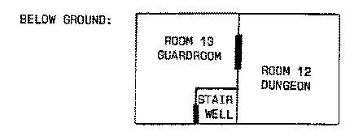

6 THE ENVIRONMENT UNFOLDS
=====
The Initializing Subroutine
As you saw at the end of the last chapter, line 20 sends action to the initializing subroutine which begins at line 2600. Here it is:
```
2590 REM ***********
2600 REM INITIALISE

2670 REM ***************
2680 REM SET UP CASTLE
2690 DIM A(19,7)
2700 FOR B=1 TO 19
2710 FOR C=1 TO 7
2720 READ A(B,C)
2730 NEXT C
2740 NEXT B
```
These are the lines which fill the array with the numbers which represent the directions the player can move from various rooms.

The seventh element for each room is used to hold either treasure or terror, as will be explained in the next chapter.

In this game, there are six possible directions, the four compass points as well as up and down. The castle has three levels, and you are able to move from one to the next via a circular stairwell, and "an ancient hydraulic lift." The numbers which follow the DATA statements (lines 3310 to 3490) represent, for each room: north, south, east, west, up and down. Here they are:
```
3300 ******************
3310 DATA 0,2,0,0,0,0,0:REM ROOM 1
3320 DATA 1,3,3,0,0,0,0:REM ROOM 2
3330 DATA 2,0,5,2,0,0,0:REM ROOM 3
3340 DATA 0,5,0,0,0,0,0:REM ROOM 4
3350 DATA 4,0,0,3,15,13,0:REM ROOM 5
3360 DATA 0,0,1,0,0,0,0:REM ROOM 6
3370 DATA 0,8,0,0,0,0,0:REM ROOM 7
3380 DATA 7,10,0,0,0,0,0:REM ROOM 8
3390 DATA 0,19,0,8,0,8,0:REM ROOM 9
3400 DATA 8,0,11,0,0,0,0:REM ROOM 10
3410 DATA 0,0,10,0,0,0,0:REM ROOM 11
3420 DATA 0,0,0,13,0,0,0:REM ROOM 12
3430 DATA 0,0,12,0,5,0,0:REM ROOM 13
3440 DATA 0,15,17,0,0,0,0:REM ROOM 14
3450 DATA 14,0,0,0,0,5,0:REM ROOM 15
3460 DATA 17,0,19,0,0,0,0:REM ROOM 16
3470 DATA 18,16,0,14,0,0,0:REM ROOM 17
3480 DATA 0,17,0,0,0,0,0:REM ROOM 18
3490 DATA 9,0,16,0,0,0,0:REM ROOM 19
```
The Maps
We must see now how they relate to the floor plan of the castle. Of course, when you give this game to somebody to play you do not provide them with a map. Part of the pleasure of playing Adventure is constructing a map of the environment which will give you control of it. "Walking through" an environment when you have mapped it, to check your cartographic work, is also part of the fun. The map is only given here so you can see how the program relates to it.

There are, as I said, three levels. The basement is made up of a guard room, and a dungeon, like this:



The ground floor, where you begin your quest, looks like this:


And the upper floor is built as follows:


You'll see that it is impossible to go directly from the entrance ("room 6": the entrance must have a room number, as must the exit) to the exit ("room 11") without going upstairs. There is no direct path from the west side of the castle to the eastern one. This ensures that the player is forced to do quite a bit of exploring before being able to locate the exit. It also helps to confuse the map a bit. Constructing a three-level map of the castle may take many hours, as you're sure to appreciate shortly.
